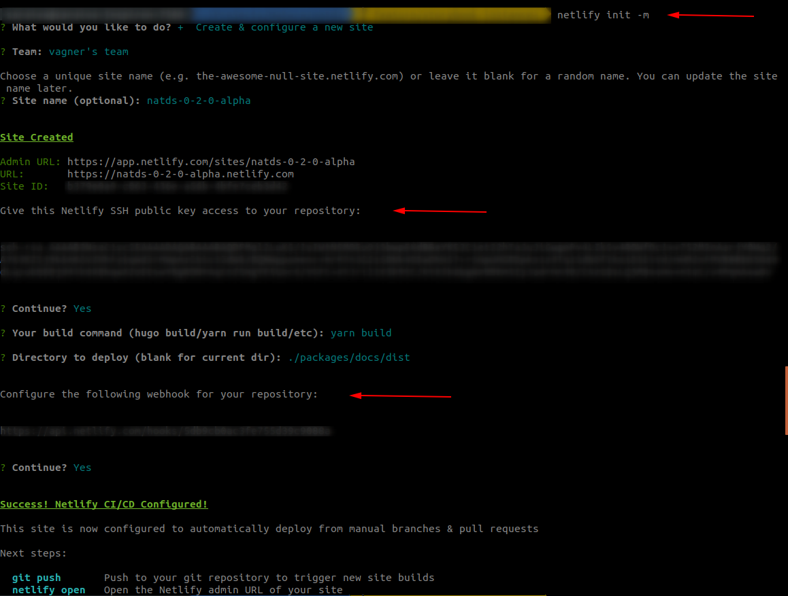
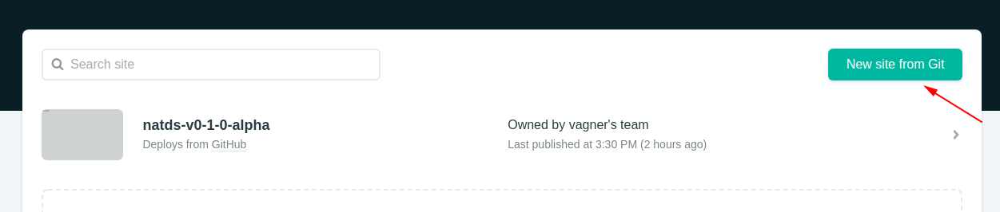
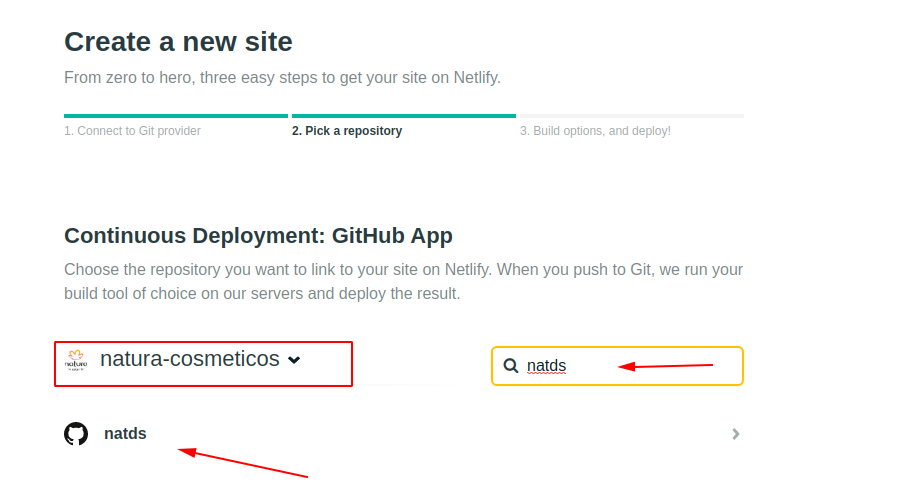
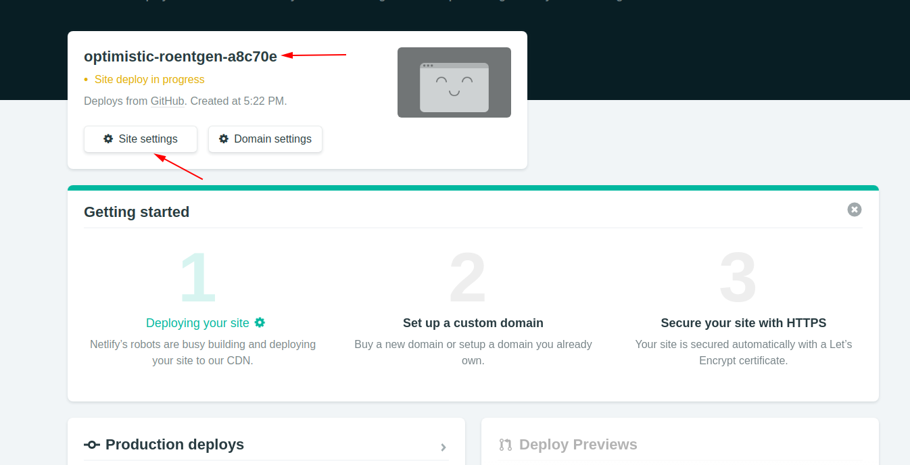
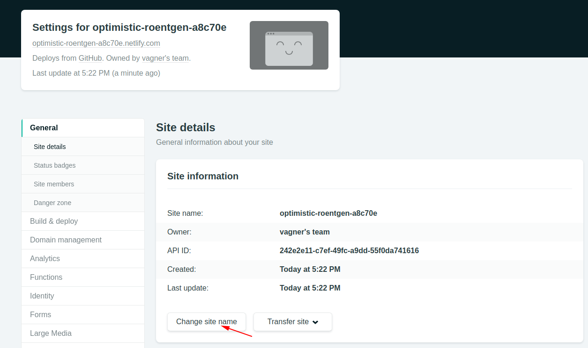

# Via Command Line

```sh
npm install -g netlify-cli

netlify login
netlify init -m
```

Follow the instructions as well as the example below:


- In `Give this Netlify SSH public key access to your repository`, add deploy key in the repository (https://github.com/natura-cosmeticos/natds/settings/keys)
- In `Configure the following webhook for your repository`, add a webhook in the repository (https://github.com/natura-cosmeticos/natds/settings/hooks)

# Via Netlify UI (admin)

## Follow the below steps reported in the images:

**First change to git base for a new site**



**Change to repository `natura-cosmeticos/natds`**


**Change milestone branch to deploy (e.g. `feature/setup`). Add command to build and change publish directory (exactly `yarn build` and `./packages/docs/dist`)**


**After changing the published name for a milestone, starting with `natds` (e.g. `natds-v0-2-0-alpha`)**




**In conclusion, you will be able to access the new instance of stotybook at the link shown in the overview**


